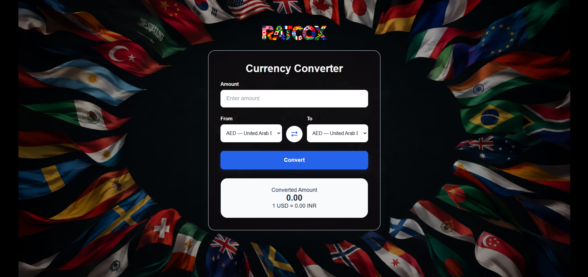

# 🌍💱 RATCOX | CURRENCY CONVERTER


---

## 🌐 About This Project

**RATCOX** is a professional currency converter built with HTML, CSS, and Vanilla JavaScript. It allows users to convert amounts between 145+ currencies using exchange-rate data fetched from an API (<a href="https://www.exchangerate-api.com">Rates By Exchange Rate API</a>)

The application stores the fetched exchange rates in the browser in local storage and refreshes them every 24 hours. This reduces unnecessary API requests and excess use of internet connection while allowing multiple currency conversions to be performed locally,quickly and effeciently.

---

## 🚀 Live Demo

🔗 **Website:** https://neorizonnn.github.io/RATCOX/

---

## 📸 Preview

  

---

## ✨ Features

- 💱 Converts upto 145+ currencies
- 🔄 Swap currencies instantly
- 📡 Fetches exchange-rate data from an API
- 💾 Stores exchange rates locally using **localStorage**
- 🕐 Updates stored exchange rates every 24 hours
- ⚡ Performs conversions locally after rates are fetched
- 📱 Responsive design
- 🎨 Clean and simple user interface

---

## 🛠️ Built With

- **HTML5** — Website structure and semantic markup
- **CSS3** — Styling, layouts and responsive design
- **Vanilla JavaScript** — Application logic and currency calculations
- **Exchange Rate API**  — For currency exchange rates data

## 📂 Project Structure

```text
ratcox/
|
├── img/
│   └── ...
├── sc/
│   └── sc1.png
├── index.html
├── README.md
├── script.js
├── style.css

---
```
---

## 🔮 Future Improvements

- Adding a visible rate last updated time
- Adding historical exchange-rate charts
- Adding more detailed currency information
- Adding live exchange rates with live graphs and statistics

---
## 🎯 Project Objectives

This project was developed to:

- Strengthen my core JavaScript skills
- Practice API integration
- Understand asynchronous JavaScript using **async/await**
- Practice DOM manipulation
- Learn to use localStorage
- Understand JSON data handling
- Implement real-world currency conversion logic

## 👨‍💻 Developer

**Neorizon**

GitHub: https://github.com/Neorizonnn

Email: neorizon3@gmail.com

---

## 📄 License

This project is open for learning and inspiration.

Please do not copy it directly without proper permission.

Feel free to contact me anytime.

---

### ⭐ If you found this project interesting, consider giving it a star !!


